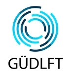

[](https://forthebadge.com) 
[](https://forthebadge.com)

# Projet GUDLFT

<p align="center">
  
</p>

 L'objectif de l'application est de rationaliser la gestion des compétitions entre les clubs (hébergement, inscriptions, frais et administration). L'application permettra aux clubs d'inscrire des athlètes aux compétitions organisées au sein
de la division. Seules les admins et les secrétaires de club auront accès à l'application.


Actuellement, les clubs gagnent des points via la mise en place et le déroulement des
compétitions. Chaque club peut voir son solde actuel et échanger des points pour inscrire
des athlètes à de futures compétitions, à raison d'un point par inscription. Chaque
compétition aura un nombre limité d'inscriptions, et chaque club ne peut inscrire qu'un
maximum de 12 athlètes.


 ## Réalisations
 - Phase 1 du projet : régler les bogues du POC.
 - Phase 2 du projet : améliorer les fonctionnalités de l'application par des tests.

## Cas d'usages

 #### Cas d'usages d'un utilisateur "visiteur" (non connecté)
- Par souci de transparence, les visiteurs peuvent consulter le nombre de points disponibles pour chaque club. 

 #### Cas d'usages d'un utilisateur "secrétaire"
  1. Les secrétaires des clubs pourront utiliser leur adresse électronique pour se connecter.
  2. Les secrétaires peuvent consulter la liste des compétitions à venir.
  3. Les secrétaires pourront ensuite sélectionner une compétition et utiliser leurs points pour acheter des places.
  4. Les secrétaires devraient voir un message confirmant le nombre de places achetées, ou un message indiquant que le concours est complet. Les points utilisés doivent être déduits du total précédent.
  5. Les secrétaires ne devraient pas pouvoir réserver plus de places que celles disponibles ou plus de 12 places dans une compétition (afin de garantir l'équité envers les autres clubs).
  6. Les secrétaires des clubs pourront se déconnecter.

 #### Cas d'usages d'un utilisateur "admin"
 1. Les admins pourront utiliser leur adresse électronique pour se connecter.
 2. Les admins pourront inscrire un secretaire de club sur l'application.
 3. Les admins pourront supprimer ou bloquer un compte secretaire de club sur l'application.
 4. Les admins pourront supprimer ou bloquer un compte secretaire de club sur l'application.
 5. Les admins pourront ajouter une compétition sur l'application.
 6. Les admins pourront supprimer une compétition sur l'application.
 7. Les admins pourront attribuer des points aux secrétaires de club sur l'application.
    
    

## Pré-requis

* Installer Python 3 : [Téléchargement Python 3](https://www.python.org/downloads/)
* Installer git : [Téléchargement Git](https://git-scm.com/book/fr/v2/D%C3%A9marrage-rapide-Installation-de-Git)

## Installation

### 1. Télécharger le projet sur votre répertoire local : 
```
git clone https://github.com/NidalChateur/OC_P11_GUDLFT.git 
cd OC_P11_GUDLFT
```
### 2. Mettre en place un environnement virtuel :
* Créer l'environnement virtuel: `python -m venv env`

### 3. Activer l'environnement virtuel
* Activer l'environnement virtuel :
    * Windows : `env\Scripts\activate.bat`
    * Unix/MacOS : `source env/bin/activate`
   
### 4. Installer les dépendances du projet
```
pip install -r requirements.txt
```

### 5. Démarrage
* Lancer le script à l'aide de la commande suivante : `flask run`
* Lorsque le serveur fonctionne, l'application peut être consultée à partir de l'url [http://127.0.0.1:5000].
  Les étapes 1, 2 et 4 ne sont requises que pour l'installation initiale. Pour les lancements ultérieurs du serveur de l'application, il suffit d'exécuter les étapes 3 et 5 à partir du répertoire racine du projet.


